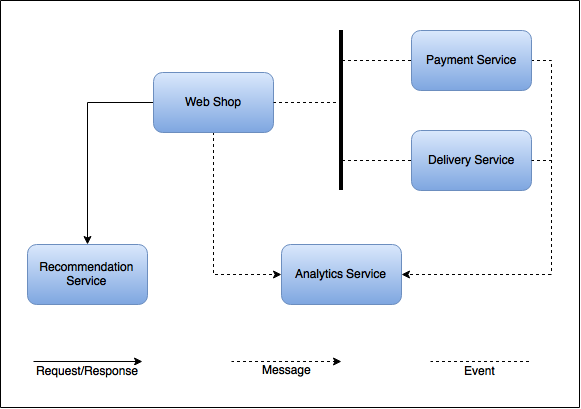

= Sample system design
Doc Writer <uwe.friedrichsen@codecentric.de>
v0.2, 2016-02-18
:homepage: https://github.com/ufried/resilience-tutorial

== Services (Top level bulkheads)

The initial system design for Awesome, Inc. consists of the following application/services:

* A _web shop_ where the customer can view and order the entries of Awesome, Inc.
* A _payment service_ which takes care of the customer payments
* A _delivery service_ which handles the delivery of bought entries
* A _recommendation service_ which recommends other entries based on the entries currently viewed and bought
* An _analytics service_ which captures information from all other services in order to gain new insights

In a more complex scenario, where the web shop needed to manage many more entries, the shop would be split in several services that would probably be implemented using the http://scs-architecture.org/[SCS approach]. As the store in this case study will be rather simple the decision was made not to split it up because it is expected that the store will remain quite small (in terms of source code).

An alternative even for the small web shop would be to split it between viewing entries and putting them in the shopping cart as one part and checkout as the other part.

== Datastores

Each service has its own database (not shown in the image). From a resilience point of view all measures on service level do provide limited value if all services are bound to a single database that acts as a single point of failure for all services (except if the services can still provide a useful - maybe degraded - service in case of a database failure).

Another design consideration would be to decide if the services themselves and the databases they use should be treated as individual bulkheads. The services definitely must be capable to respond timely even in face of a database problem. Yet, it needs to be considered if the service should simply signal unavailability in such situations or if it should provide a better service. As this is a business related decision, it cannot be answered generally.

== Communication paradigms

The system landscape uses three different communication paradigms:

* The _web shop_, the _payment service_ and the _delivery service_ communicate via events because it provides the best decoupling between the services. Also, these services describe a flow, i.e., they run after each other which makes a request/response communication paradigm unfeasible.
* The _web shop_ communicates with the _recommendation service_ using the synchronous request/response paradigm. As the web shop needs to ask for the information from the recommendation service and uses the response within its own activities, a request/response paradigm is feasible.
* The _web shop_, the _payment service_ and the _delivery service_ communicate with the _analytics service_ sending messages to the _analytics service_. It is okay if some messages are lost. Therefore a "fire-and-forget" messaging communication style will be used.

NOTE: It is also possible to use different communication patterns between the services and usually you will not use all three paradigms within such a small service landscape. Yet, here we used it to have a training ground for different resilience patterns.

Additionally, there will also be centralized logging and metrics which are not shown in the image as they are not of particular interest for the resilience tutorial.

_Side note_: If you would log all events that happen in the system, you could use the log stream as input for the analytics service. But this optimization is out of the scope of this tutorial ... ;-)
