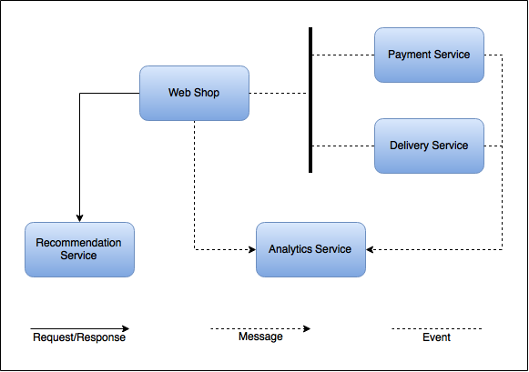

= System design
Doc Writer <uwe.friedrichsen@codecentric.de>
v0.1, 2016-02-16
:homepage: https://github.com/ufried/resilience-tutorial

The initial system design for Awesome, Inc. consists of the following application/services:

* A _web shop_ where the customer can view and order the products of Awesome, Inc.
* A _payment service_ which takes care of the customer payments
* A _delivery service_ which handles the delivery of bought products
* A _recommendation service_ which recommends other products based on the products currently viewed and bought
* An _analytics service_ which captures information from all other services in order to gain new insights

The system landscape uses three different communication paradigms:

* The _web shop_, the _payment service_ and the _delivery service_ communicate via events because it provides the best decoupling between the services. Also, these services describe a flow, i.e., they run after each other which makes a request/response communication paradigm unfeasible.
* The _web shop_ communicates with the _recommendation service_ using the synchronous request/response paradigm. As the web shop needs to ask for the information from the recommendation service and uses the response within its own activities, a request/response paradigm is feasible.
* The _web shop_, the _payment service_ and the _delivery service_ communicate with the _analytics service_ sending messages to the _analytics service_. It is okay if some messages are lost. Therefore a "fire-and-forget" messaging communication style will be used.

NOTE: It is also possible to use different communication patterns between the services and usually you will not use all three paradigms within such a small service landscape. Yet, here we used it to have a training ground for different resilience patterns.

Of course there is also some centralized logging and metrics which are not shown in the image as they are not of particular interest for the resilience tutorial. Side note: If you would log all events that happen in the system, you could use the log stream as input for the analytics service. But this optimization is out of the scope of this tutorial ... ;-)
